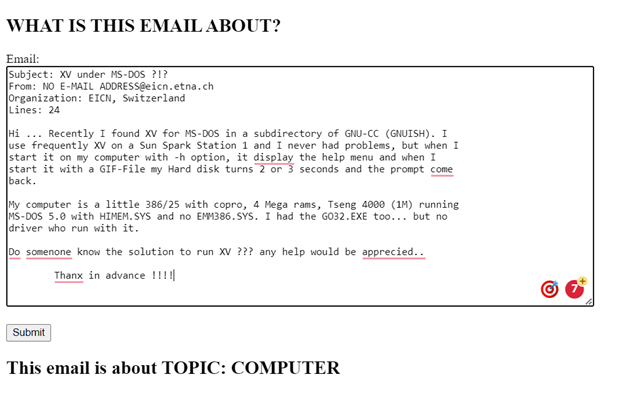

# Funnel_API
 


This API takes an email as input and output the topic of it.

## Description

The model consists two steps:
* step 1: Topic Modeling using LDA. Inputs are unlabeled unstructured emails (emails not included in this public repo due to privacy concern). Emails are grouped into 4 topics: "TIME";"COMPUTER";"INFORMATION";"SPORTS". Each email is then labeled with one of the four topics.
* step 2: Multiclass classification using Xgboost. The model is trained with the emails as independent variable and their corresponding topics as dependent variable. The trained classifer to detect the topic of a new email. \
\
The details of the modeling steps and results can be found in [notebook](001_model/Funnel_model_building.ipynb)

## Getting Started

### Dependencies

* The model was built in Python 3.9

### Installing

* download the Funnel_API.
* go to Funnel_API/002_flaskapp
* step up virtual enviroment using following two commands:\
\
    virtualenv --python=python3 venv\
    source venv/bin/activate
 \
* install all package by command:\
    pip install -r requirements.txt


  

### Executing program

* How to run the program
* Step-by-step bullets
```
code blocks for commands
```
